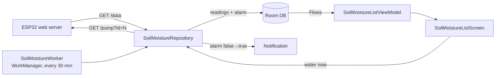

# Soil Moisture Screen

Adds a **"Ґрунт"** (Soil) tab that shows soil-moisture readings from ESP32 watering
stations across multiple rooms and potted plants, plus room air temperature/humidity, a
manual *water now* button with the last-watered time, and a push notification when a
watering fails to raise moisture (e.g. an empty water tank).

## Topology

One **ESP32 board per room**. Each board runs a small local web server and exposes several
soil-moisture channels (one per pot) plus a BME280 climate sensor. A room is addressed by
its ESP32 IP; a pot is addressed by its `channel` on that board.

```
Room "Kitchen"  ──►  ESP32 @ 192.168.1.50  ──►  channel 0 → "Ficus"
                                              └─  channel 1 → "Basil"
Room "Bedroom"  ──►  ESP32 @ 192.168.1.51  ──►  channel 0 → "Cactus"
```

Rooms and pots are user-configurable in the app (add / edit / delete).

## Data flow



- **Polling** — `SoilMoistureWorker` (WorkManager) polls every 30 minutes. After a manual
  watering the app also asks for one quick re-poll ~5 minutes later
  (`WateringRecheckScheduler`) so the device's verdict is picked up promptly.
- **Storage** — the latest readings and the mirrored alarm flag live in Room; the UI
  observes them reactively via Flows.
- **Notifications** — reuse the local `NotificationCompat` channel from `CO2JobService`.

## "Watering didn't help" is decided on the ESP32

The device is in the best position to detect an ineffective watering — it measures every
60 seconds and knows the exact watering moment. So the verdict lives on the firmware, and
the app is a thin notifier:

1. On watering the ESP32 records `pctBeforeWater[i]`.
2. After a settle delay (`WATER_SETTLE_MS`, 5 min) it compares current moisture; if it did
   not rise by `WATER_RISE_THRESHOLD` (3%), it latches `waterAlarm[i]`.
3. `/data` reports `waterAlarm` per pot.
4. The app mirrors it onto `PotEntity.alarmActive` and sends **one** notification on the
   `false → true` transition (no spam while it stays on; cleared when the next watering
   succeeds).

Firmware: [`timars12/timHomeArduino`](https://github.com/timars12/timHomeArduino).

## ESP32 REST contract

```
GET http://<room-ip>/data
{
  "bme": true,
  "temp": 24.5,
  "hum": 55.0,
  "pres": 1006.0,
  "pots": [
    { "id": 0, "name": "Ficus", "valid": true, "pct": 42, "threshold": 30, "pump": false, "waterAlarm": false }
  ]
}

GET http://<room-ip>/pump?id=<channel>   → 200 OK   // starts the pump for that pot
```

- `id` is the pot's channel index — the app maps readings to configured pots by it, not by
  array order.
- `pct` is soil moisture in percent; `waterAlarm` is the device's ineffective-watering flag.

## Modules touched

| Module | What |
| --- | --- |
| `core:network` | `SoilMoistureApi` (`/data`, `/pump`) + `SoilMoistureStatusResponse` / `PotReading` |
| `core:database` | `RoomEntity`, `PotEntity` (`alarmActive`), `SoilMoistureReadingEntity`, `RoomClimateReadingEntity`, `WateringEventEntity` + DAOs (DB v7) |
| `core:data` | `SoilMoistureRepository` / `Impl` — polling, alarm mirroring, connection-error tracking |
| `mock` | `MockSoilMoistureRepositoryImpl` (used when mock mode is on) |
| `base` | mock/real repository switch via `DataStoreManager.isUseMockDate()` |
| `feature:soilmoisture` | list, room-edit and pot-edit screens + Dagger wiring |
| `app` | `SoilMoistureWorker`, `AppWateringRecheckScheduler`, bottom-nav entry |

## Connection errors

Every poll records the outcome on the room: on failure (unknown host / timeout / no IP)
`RoomEntity.lastPollSuccessful` and `lastPollError` are updated and the room card shows the
reason instead of stale climate values.

## Mock mode

With mock mode enabled (`DataStoreManager.isUseMockDate()`), `MockSoilMoistureRepositoryImpl`
fabricates climate and moisture values so the screen is usable without a real ESP32. The
mock never raises a watering alarm (that verdict only comes from a device).

## Testing

- `SoilMoistureListViewModelTest` — grouping, empty state, watering-error snackbar
  (Robolectric, because the ViewModel logs an analytics `Bundle`).
- `SoilMoistureRepositoryImplTest` — readings persistence, connection-failure handling and
  the alarm `false→true` / stay-on / turn-off transitions.
